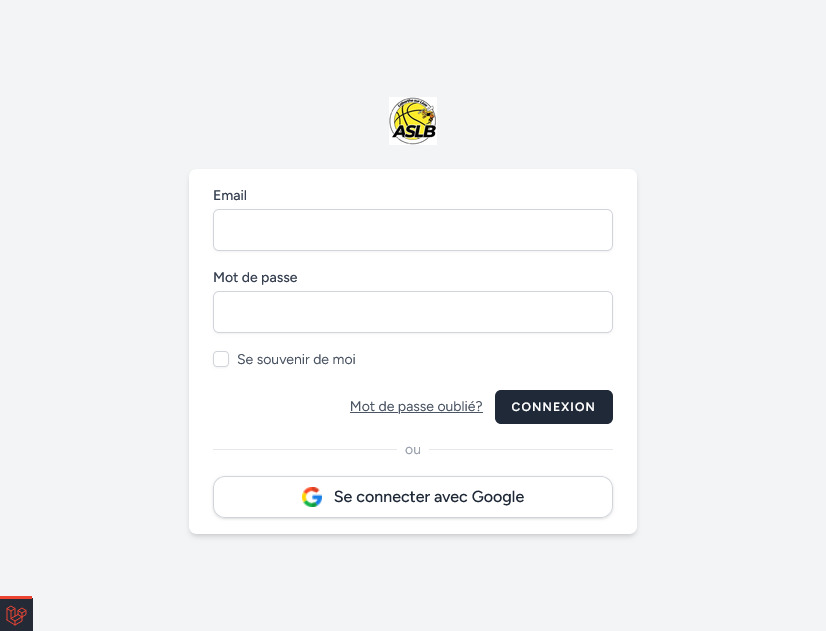

# Page de Connexion

Deux modes de connexion

## Identifiant / Mot de passe

Pour se connecter en utlisant ses identifiants 

## Compte Google

Si le mail renseigné est un compte google, il est possible de se connecter en utlisant le bouton se connecter avec Google.

A noter : aucune information du compte ne sera utilisé autre que le nom et email. Ce mode permet la simplification de connexion.

