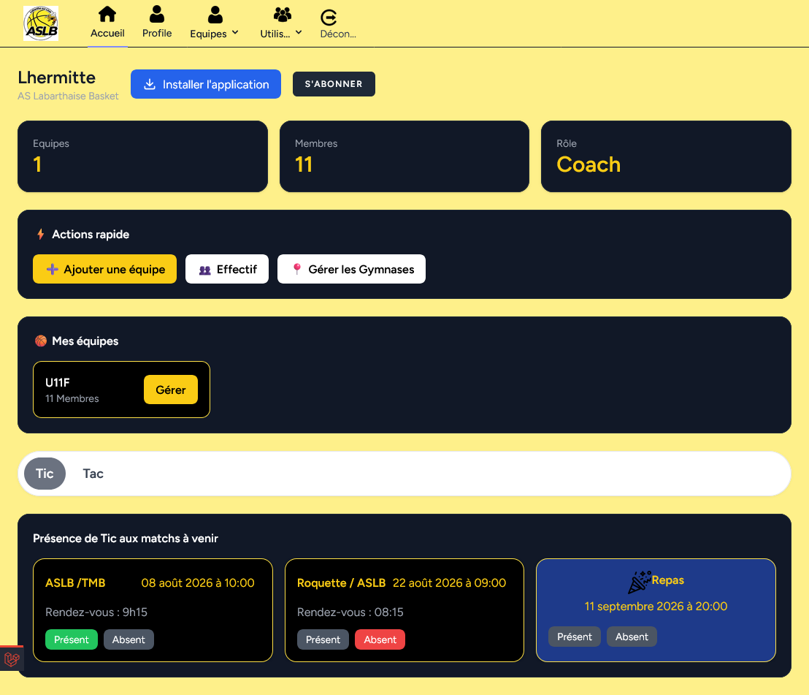

# Page d'accueil Entraineur

## Bouton Installer l'application
 
Permet d'installer l'application sur le smartphone ou ordinateur.
Ce boutton disparait si l'application à été installée.

## Bouton S'abonner 

 Permet de recevoir les notification

## Liste des Equipes

Toutes les équipes dont l'entraineur est administrateur.

## Liste des joueurs de l'entraineur

Ce sont les joueurs (membres) qui sont associé au compte utilisateur de l'entraineur.
C'est cette liste qui est présenté aux parent.

Possibilité de définir les présence aux matchs et événements des joueurs.

