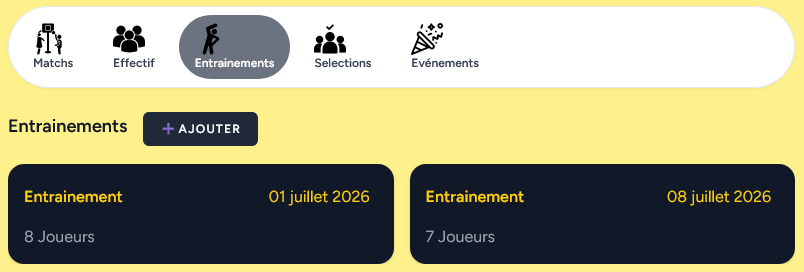

# Liste des entrainements de l'équipe

Affiche la liste des entrainements de l'équipe.

Il n'a pas été prévu de créer à l'avance tous les entrainements de l'année.
A chaque début d'entrainement il faut cliquer sur ajouter pour gérer les présences.

Il n'a pas été prévu non plus que les parents peuvent gérer la présence des jouers aux entrainements (pas de système de convocation comme sur sporteasy)

