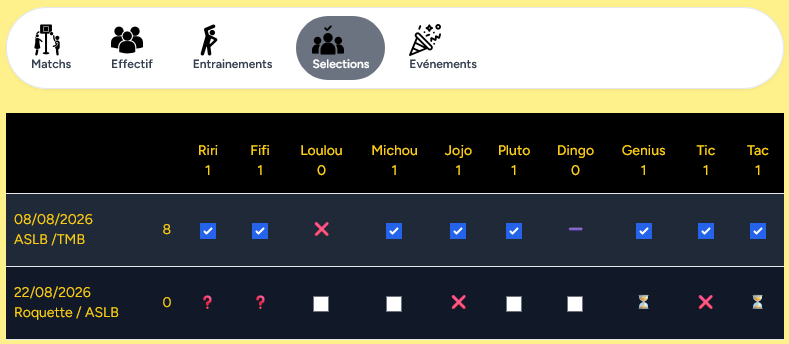

# Sélections des joueurs

Ce menu permet de synthétiser la sélection des jueurs aux matchs.
Et de visualiser le nombre de match joué par joueurs.

Les checkbox permettent de choisir les joueurs parmis les disponibilités.

## Symboles :

- ❌ : le joueur n'est pas disponible

- ❓ : le joueur est défini à peut être

- ⏳ : le joueur n'a pas encore répondu

- ➖​ : le joueur a été ajouté dans l'équipe après la date du match.

