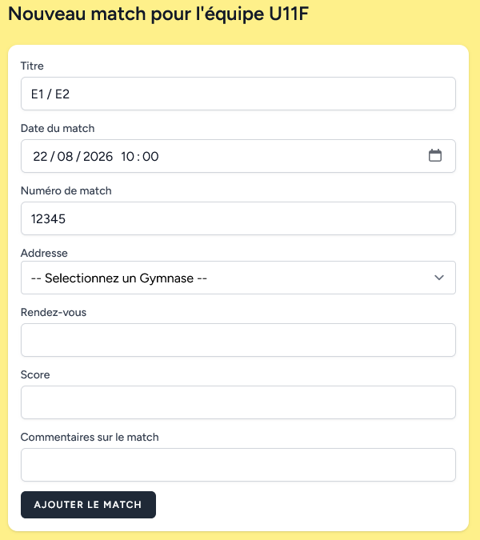

# Ajouter un match

## Titre

En général on inscrit E1 / E2

## Date

date et heure du match, **ne pas oublier** de mettre l'heure de début du match. 

## Numéro

Référence du match (cf comité)

## Adresse

choisir parmis la liste des gymnase proposé, s'il n'existe pas il faut aller le rajouter depuis la page d'acceuil.

## Rendez-vous

Pour définir le lieu et l'heure de rendez-vous

## Score

Le score du match (normalement à laisser vide à la création du match).

## Commentaire

Champ libre qui est uniquement visible par les coachs (administrateur de l'équipe).

Tous ces champs sont modifiable plus tard.

