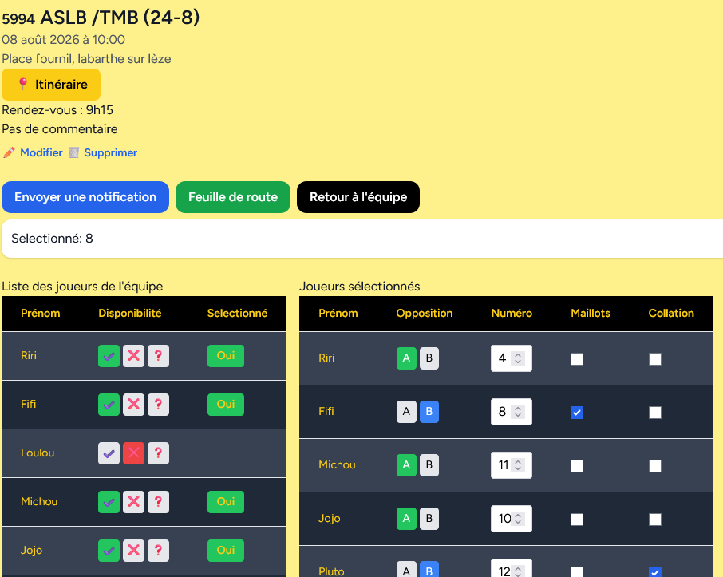

# Afficher/modifier un match 1/2

Cette page permet de gérer le match.

## Entête

Décrit les informations du match, le bouton itinéraire lance l'application de navigation par défaut ou une liste de choix d'applications.

## Boutons

_Envoyer une notification_ : permet d'envoyer une notification aux applications abonnées pour demander de valider la disponibilité.

_Feuille de route_ : uniquement pour les équipes U11, génère l'excel du comité.

_retour à l'équipe_ : retourne sur la page de gestion de l'équipe.

## Liste des joueurs

Permet de modifier les disponibilités et gérer les sélectionnés.

## Joueurs sélectionnés

Permet de gérer les options de match par joueur, ces options sont modifiable dans le menu paramètre de l'équipe.

