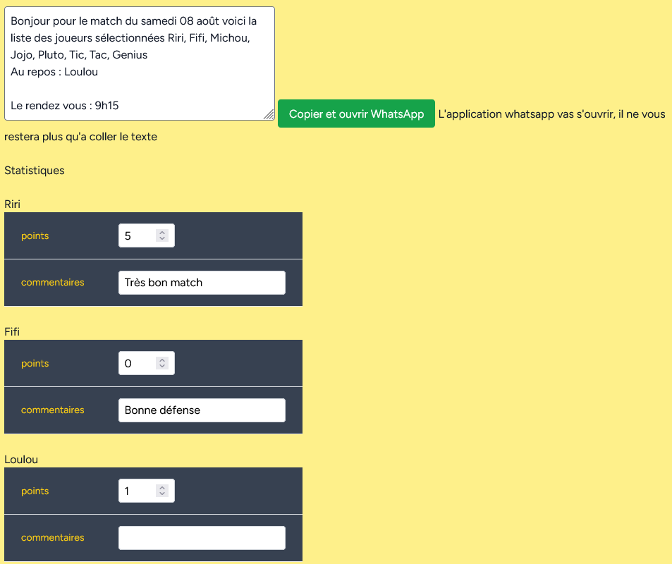

# Afficher/modifier un match 1/2

## Whatsapp

Texte généré pour le match, modifiable dans les paramètres de l'équipe. Le bouton _Copier et ouvrir WhatsApp_ copie le texte dans le presse papier et ouvre l'application whatsapp sur le groupe défini dans les parmètres de l'équipe. Il ne reste plus qu'à coller.

## Statistiques

Les statistiques par joueurs peuvent être rentrés. Ces stats ne sont pas visibles par les parents et sont configurable dans les paramètres de l'équipe.

