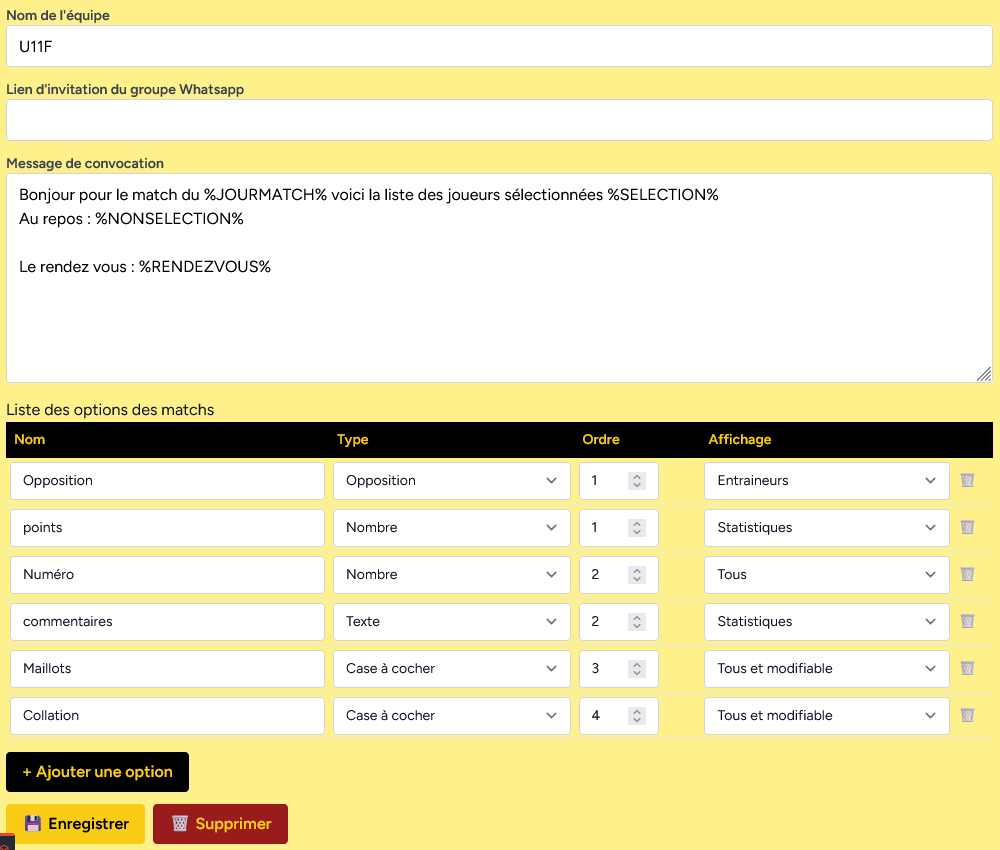

# Paramètres d'équipe 2/2 (options des matchs)

## Nom
Le nom qui apparait dans le tableau

## Type

- _Texte_ : un simple texte
- _Nombre_ : un simple nombre
- _Case à cocher_ : une case à cocher
- _Opposition_ : un choix entre A et B

## Ordre

L'ordre d'apparition dans le tableau

## Affichage

- _Entraineurs_ : uniquement visible par les entraineurs
- _Tous_ : visible pour tous (entraineurs et parents) mais modifiable que par les entraineurs.
- _Tous et modifiable_ : modifiable par tous.
- _Statistique_ : uniquement visible dans la partie statistique des matchs

