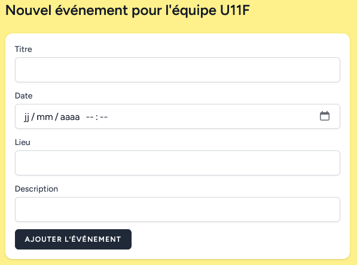

# Ajouter un événement

Tous ces champs sont modifiable plus tard.

## Titre

Le titre de l'événement

## Date

date et heure de l'événement, **ne pas oublier** de mettre l'heure. 

## Lieu

Le lieu

## Description

une description

