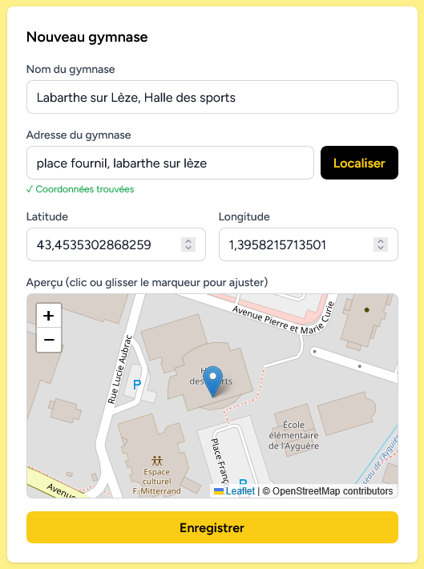

# Gérer les Gymnases

Cette page permet d'ajouter, supprimer des gymnases

## Nom du gymnase

utiliser le format Ville puis le nom du Gymnase afin de faciliter la recherche.

## Adresse

ajouter une adresse et le bouton localiser permet de se placer sur la carte.

## Latitude et Longitude

rempli automatiquement par l'icone de la carte

## Aperçu

permet de se positioner précisement sur un lieu.

La liste des gymnase présents est affiché à la suite dans le tableau.

