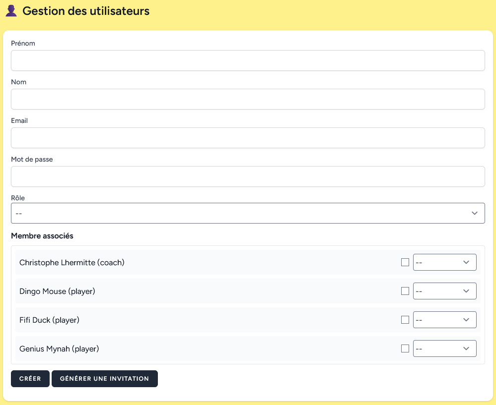

# Gestion des utilisateurs

Cette page permet de créer des nouveau utilisateurs : ceux qui se connecterons à l'application.

Un mécanisme d'invitation permet d'envoyer un lien à un parent (ou autre) pour qu'il puisse finir de remplir le formulaire avec ses identifiants de connexion.
Pour celà il faut juste remplir le nom, le role et associer les membres. Puis le bouton _Générer une invitation_ crée un lien qu'il faut envoyer à la personne via whatsapp, email, sms.

